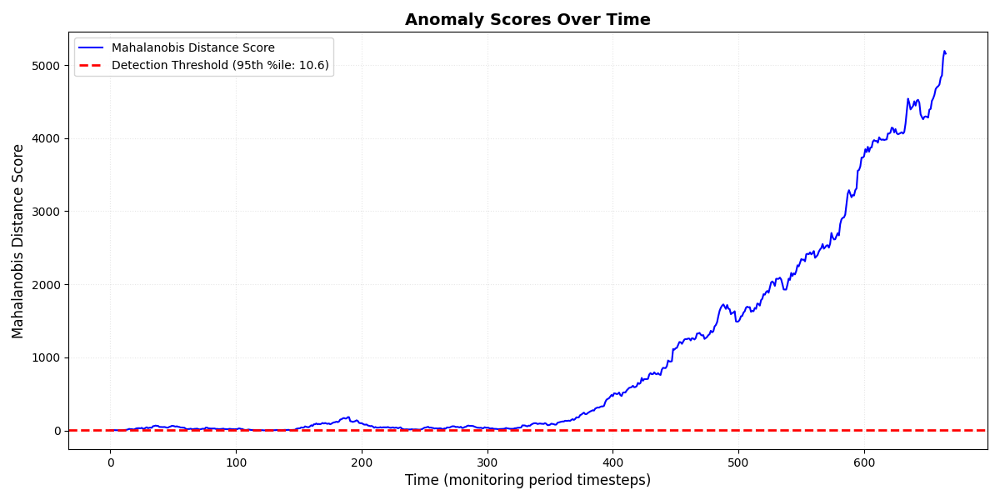

# Silent Drift Detection

Lightweight pipeline for detecting "silent drift" in ML telemetry using
multivariate statistical anomaly detection (Mahalanobis distance).

This repository provides an end-to-end demonstration: synthetic data
generation with injected drift, rolling-window feature engineering, a
Mahalanobis-based detector, evaluation helpers, and an exploration
notebook for analysis and visualizations.

## Repository Layout

- `main.py` - End-to-end orchestrator that saves artifacts to `data/`.
- `src/` - Core modules:
  - `data_generator.py` - Synthetic telemetry generator with injected drift.
  - `preprocessing.py` - Rolling-window feature extraction (mean/std).
  - `anomaly_model.py` - `DriftDetector` implementation (Mahalanobis distance).
  - `evaluator.py` - Small helpers to summarize anomaly counts and ratios.
- `data/raw/` - Raw telemetry CSVs (generated by `main.py`).
- `data/processed/` - Feature CSVs and saved plots (e.g. `anomaly_scores.png`).
- `notebooks/exploration.ipynb` - Jupyter notebook for interactive analysis.
- `tests/` - Unit tests (smoke tests for the detector).

## Quick Start (macOS / zsh)

1. Create and activate a virtual environment (recommended):

```bash
python3 -m venv .venv
source .venv/bin/activate
```

2. Install dependencies:

```bash
pip install -r requirements.txt
# or install manually
pip install numpy pandas scikit-learn matplotlib seaborn pytest
```

3. Run the full pipeline:

```bash
python main.py
```

This will generate synthetic telemetry, compute rolling features, fit the
detector on the clean baseline period, score the monitoring period, save
`data/processed/anomaly_scores.png`, and print evaluation metrics.

4. Open the exploration notebook (interactive analysis):

```bash
jupyter notebook notebooks/exploration.ipynb
```

## Notes & Best Practices

- Baseline vs Monitoring: The pipeline uses a baseline split (default 30%)
  to learn the reference distribution. Always derive detection thresholds
  from the clean baseline; deriving them from the monitoring data is an
  anti-pattern (it biases thresholds upward and masks drift).
- Threshold choice: Default is the 95th percentile of baseline Mahalanobis
  scores (recommended). If labeled data exist, use ROC/AUC to optimize.
- Headless operation: Plots are saved to `data/processed/` for CI-friendly runs.

## Running Tests

Run the test suite with:

```bash
pytest -q
```

## Contributing

- Add feature engineering under `src/preprocessing.py`.
- Try different detectors in `src/anomaly_model.py` and compare results.


## Results

### Anomaly Detection Output

The following plot shows the Mahalanobis Distance Score for anomaly detection over time:




# Silent Drift Detection 🚦  
_Efficient, Lightweight Anomaly Detection for ML Telemetry_

 
 


---

## Description

Silent Drift Detection is a Python-based pipeline for detecting "silent drift" in machine learning telemetry using robust multivariate statistical methods. It helps you monitor your ML systems for subtle, hard-to-detect changes in data distribution—before they impact model performance.

**Why is this useful?**  
Silent drift can degrade model accuracy without obvious failures. This tool provides early warning, enabling proactive retraining and system health monitoring.

---

## Key Features

- 🚀 **End-to-End Pipeline:** From synthetic data generation to evaluation and visualization.
- 📊 **Mahalanobis Distance Detector:** Multivariate anomaly scoring for robust drift detection.
- 🛠️ **Rolling-Window Feature Engineering:** Captures evolving data patterns.
- 🖼️ **Automated Visualizations:** Plots anomaly scores and detection thresholds.
- 🧪 **Test Suite:** Includes unit tests for reliability.
- ⚡ **Lightweight & Fast:** Minimal dependencies, easy to integrate.

---

## Installation

Clone the repository and install dependencies:

```bash
git clone https://github.com/Sushmithameduri/silent-drift-project.git
cd silent-drift-project
python3 -m venv .venv
source .venv/bin/activate
pip install -r requirements.txt
```

---

## Usage

Run the full pipeline:

```bash
python main.py
```

This will:
- Generate synthetic telemetry data
- Compute rolling features
- Fit the anomaly detector
- Score the monitoring period
- Save results and plots to `data/processed/`

### Example Output


---

## Configuration

You can customize the pipeline via command-line arguments in `main.py`:

- `--n`: Number of samples (default: 1000)
- `--seed`: Random seed for reproducibility
- `--train`: Train the detector
- `--eval`: Evaluate and plot results
- `--output-dir`: Output directory for artifacts

Example:

```bash
python main.py --n 2000 --seed 123 --output-dir ./output
```

---

## Contributing

Contributions are welcome! To get started:

1. Fork the repository
2. Create a new branch (`git checkout -b feature/your-feature`)
3. Commit your changes (`git commit -am 'Add new feature'`)
4. Push to the branch (`git push origin feature/your-feature`)
5. Open a Pull Request

Please see the `CONTRIBUTING.md` for guidelines.

---

## License

This project is open-source and available under the [MIT License](LICENSE).

---

_Questions or feedback? Open an issue or contact the maintainer!_


